# Environment Variable and Set-UID Program

This lab introduces the basics of working with environment variables and Set-UID programs in Linux. The lab was performed on an Ubuntu virtual machine. The lab demonstrates how environment variables are inherited how fork() and execve() interact with them, and explores security issues with Set-UID programs.

---

## Lab Tasks
### Manipulating Environment Variables 

#### Viewing Environment Variables

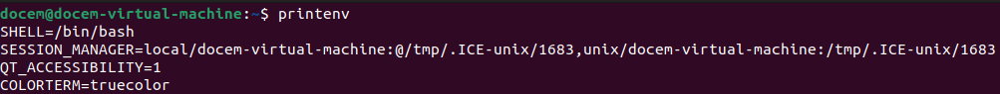

The "printenv" command displays every environment variable that is currently set.

#### Viewing Specific Environment Variables 

The two commands in the above snippet the environment variable for the Present Working Directory (PWD). Grep is used to search for the specific variable in command 2, while command one shows the value of the specific variable.

#### Setting and Unsetting Environment Variables

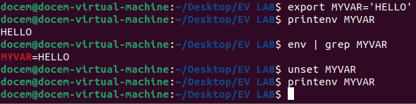

The above command sequence shows the creation and deletion of an EV. The export command successfully creates an EV 'MYVAR' with the value of 'HELLO'.  Printenv is the used to confirm the variable was actually set. Then the unset command removed the EV and is once again confirmed using the printenv command.

### Passing Environment Variables From Parent Process to Child Process

We will use the myprintenv.c program here, as seen below. The program created a child process using fork(). If the child's printenv() line is active, the child prints all environment variables.
If the parent's printenv() line is active, the parent prints them.

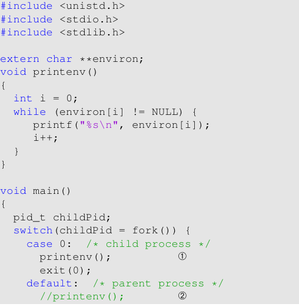

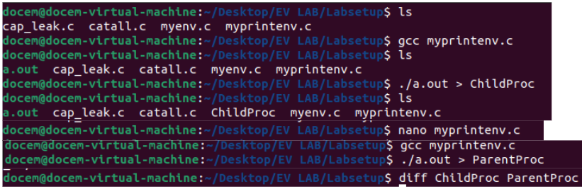

Myprintenv.c was compiled and the a.out program was ran and the ouput was saved to a file called ChildProc. The nano command was then used to edit the myprintenv.c file to commend out the child process and include the parent process. The a.out program was ran again and the ouput was saved to the ParentProc file. The two files were then compared with the diff command. The command did not produce an output signifying that each of the two files had the exact same contents.
This confirms that environment variables are completely inherited from the parent process to the child process when the fork() call is used. 
The child process receives an exact copy of the parents environment variables. Because of this, it can be concluded that changes to the child process have no effect on the parent process.

### Environment Variables and execve() 
The program myenv uses execve() to run the /usr/bin/env command, replacing the current process. It sets up the command's arguments and can be run in two ways; one version passes NULL, giving the process an empty environment, and the other passes environ, giving the current environment.

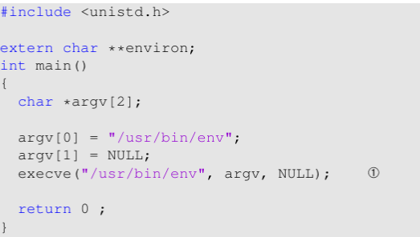

#### Step 1
I compiled and ran the myenv program. Line of code we are looking at is execve("/usr/bin/env", argv, NULL);

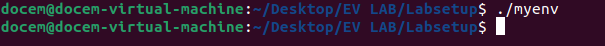

The program did not produce any output. That is because the third argument of exceve() is currently NULL. No environment variables are displayed.

#### Step 2
I then changed the third argument in execve() to environ. The new line of code is execve("/usr/bin/env", argv, environ);. I then ran the modified myenv program.

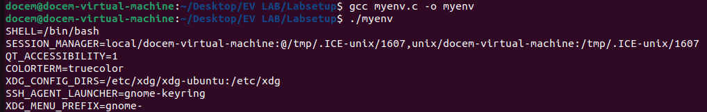

After recompiling and running the program once more, the output shows every environment variable in the parent process.  Now that environ has been passed the new program inherits the same environment variables as the parent process. 

#### Conclusion
By looking at the results, it can be determined that environment variables are not inherited automatically when using execve(). Environment variables must be explicitly passed through the third argument. When Null is passed the program receives and empty environment and when environ is passed the program receives a copy of the parent's environment variables. The program has full control over which environment their children inherit.

### Environment Variables and system()
The system() call invokes a shell to execute the command, which prints all environment variables inherited from the current process.

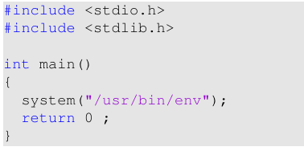

I ran the program which include the line of code we are focusing on, system("/usr/bin/env");

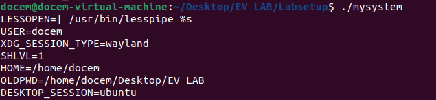

All the environment variables from the current shell are displayed. System() launches a shell process /bin/sh. This shell process inherits the environment variables from the parent. System() automatically inherits the calling processes environment variables.

### Environment Variable and Set-UID Programs

#### Step 1
I have written the following program, foo.

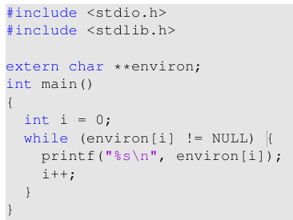

This program prints out all environment variables in the current process.

#### Step 2
I then compiled this program, set its owner to root, and made it a Set-UID program. This was done through entering the following commands into the terminal:
$ sudo chown root foo 
$ sudo chmod 4755 foo

#### Step 3
I made sure the PATH, LD_LIBRARY_PATH, and COLOR variables were set using the export command. For example, $ export COLOR=red. I then ran the foo program to check whether or not the variables I set in the shell process get to the Set-UID child process.

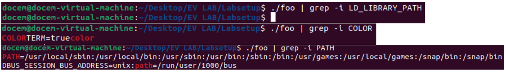

I entered the command seen above for each variable, PATH, COLOR, and LD_LIBRARY_PATH. COLOR and PATH produced an output meaning they made it to the child process. However, LD_LIBRARY_PATH produced no output signifying it didn't make it to the child process.

#### Conclusion
Environment variables are partially inherited by Set-UID programs. Most variables are inherited such as PATH, and COLOR. However, security sensitive variables are not inherited, such as LD_LIBRARY_PATH. Environment variables that can be exploited and pose security risks are filtered out when running Set-UID programs as a security measure.

### The PATH Environment Variable and Set-UID Programs

I wrote a program that invokes system(ls);. I then compiled it and made it a Set-UID program. The program can be seen below.

I can now run this program and it produces the following output.

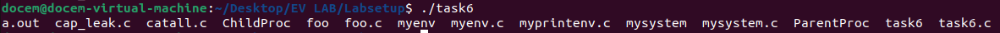

This program is vulnerable for attack. The system(ls); line creates a vulnerability an attacker can exploit. When system(ls) is ran a shell, /bin/sh, is ran and told to run ls. The shell looks for ls by searching the folders listed in PATH. Because any user can edit the PATH variable, I was able to change the PATH so my malicious code was ran. Below you can see me edit the PATH and created a C code that when ran prints "malicious code executed!!!".

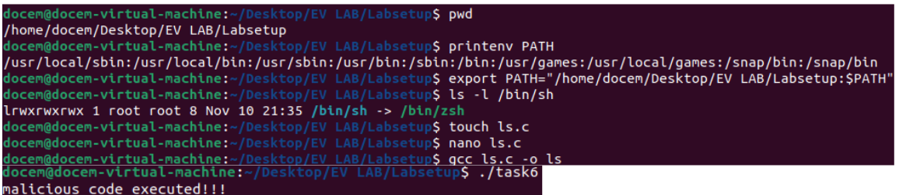

Because zsh does not drop the elevated EUID when invoked in a Set-UID process my fake ls program was ran with root privileges which makes this especially dangerous.

### The LD_PRELOAD Environment Variable and Set-UID Programs

#### Step 1
Below you will see me crate the mylib.c program and then the myprog program. Both of the programs will also be compiled, as seen below. I have also set the LD_PRELOAD environment variable using export.

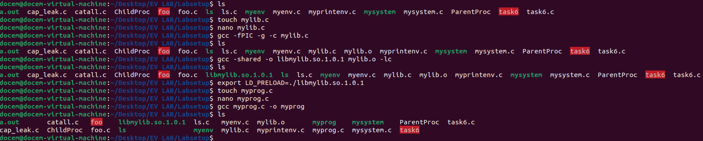

The mylib file contains the code:

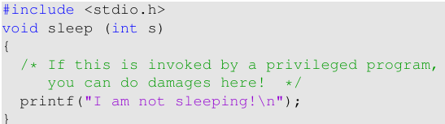

and the myprog file contains the code:

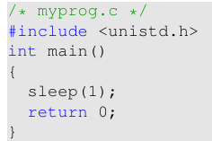

#### Step 2
Output as normal user and regular program:

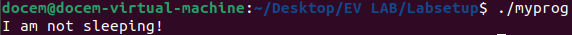

Output as normal user and Set-UID root program:

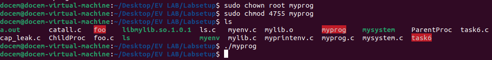

Output as root user and Set-UID root program:

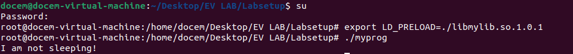

Output as user2 and Set-UID user1 program:

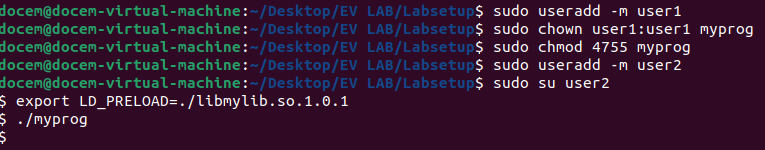

#### Step 3
When the Set-UID bit is set the dynamic linker ignores certain environment variables when real UID does not equal effective UID. LD_PRELOAD only works when you run a program as the same user who owns it.

### Invoking External Programs Using system() versus execve()

#### Step 1

I have compiled, changed the owner to root, and made a Set-UID program to the catall program seen below.

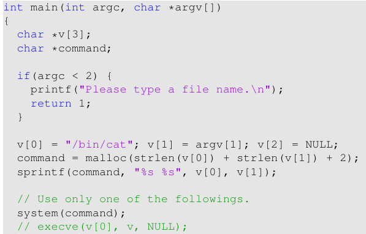

I can then make a test file called test.txt and make it so that only the owner has permissions. If I then switch my user to a different user I will no longer have permissions to do anything to the file. Below you are able to see my exploiting the program using system().

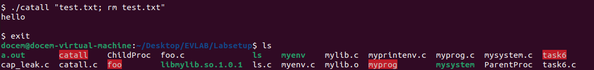

I was able to delete the test.txt file even though I should have no permissions to do so. The Set-UID program is running with root privileges, so the injected command is also running with root privileges.

#### Step 2
I now commented out the system() line and uncommented the execve() line. I entered the same commands as in step 1 to exploit the program, but I no longer could.

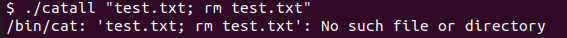

When using execve there is no shell interpretation and arguments are passed directly to the executable. When writing a program you should always use execve() in place of system() because of its increased security benefits.

### Capability Leaking
The program opens /etc/zzz and prints the resulting file descriptor. It then calls setuid(...) to drop its effective UID to the real UID, and execve(...) to run a shell. I will compile it, make it a Set-UID, and change its owner to root.

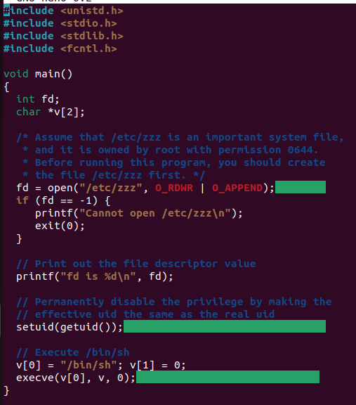

I was able to successfully exploit a capability leak vulnerability. The program opens /etc/zzz with root privileges. It then drops the privileges, but it keeps the file descriptor open. The spawned shell inherits the privileges of the file descriptor which allows exploitation.  

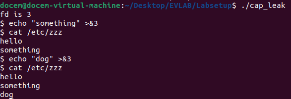