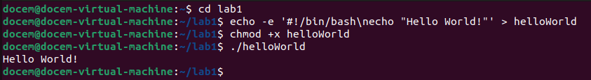

# The Linux Command Line and Security Basics

This lab introduces the basics of managing users, groups and permissions in Linux. The lab was performed in an Ubuntu virtual machine using ssh. The lab shows common system administration tasks.

---

## User Tasks

### Switching to the Root

sudo su root

This command switches the current user to the root user, giving them full administrative privileges.
Before the command is run the prompt should be as follows: docem@docem-virtual-machine:~$
After the command is run the prompt should be as follows: root@docem-virtual-machine:/home/docem#

The # symbol at the end of the prompt indicates that you have a root shell open.

### Creating Users

sudo useradd bobby -- user add is a barebones way of creating a user. No home directory is made, you don't need to set a password, and no extra configurations are required.

sudo adduser sally -- adduser requires a password to be set, creates a home directory, and allows extra configurations to be made

### Switching Users

su sally

The command switches the user to sally and asks for the password for user sally. The prompt will change after the command is entered and will now be sally@docem-virtual-machine:$

### Creating a User as Sally

sudo add user earl

This command will not create a user and an error will be passed through. Sally is not in the sudo group, so she is unable to use sudo privileges. Users who are not in the sudo group do not have access to commands that require root access.

### Changing a User's Password

sudo passwd sally

This updates a user's password and asks for the new password to be input twice.

### Logging Out of Root Shell

The principle of least privilege is bypassed by a root shell. No errors or confirmations will be pushed to prevent potentially damaging your system. If an attacker gets access to a command line with the root shell open it gives them full control of the system. Having a root shell open is dangerous and can cause damage, so you should not enter commands while in a root shell unless absolutely necessary. It is safer to be logged in as a regular user and use sudo.

### User ID

id

uid = User ID number
gid = Group ID number
groups = shows the groups a user is apart of

## Group Tasks

### What groups does ubuntu belong to?

groups 

The groups command lists the groups a user is apart off.

### Adding to Sudo Group

sudo usermod -aG sudo sally
sudo su sally
sudo adduser earl

aG stand for append group. The command adds sally to the sudo group. Now that sally is apart of the sudo group she is able to use sudo to create new users.

### Creating and Adding to Groups

sudo groupadd cybersec
sudo usermod -aG cybersec sally
groups sally

The command sequence allows you to create a new group, add a user to the group, and then check which groups the user is apart of.

## Permission and Access Control Lists

### Creating and Viewing Details of a Directory

mkdir lab1
ls -ld lab1

The commands make a new directory and then view its details. The d in front of the output tells you it is a directory. The next three rwx are the owner permissions followed by the group permissions, and the the user permissions. The r stand for read, w write, and x execute. The directory owner and then group are listed. For this directory the owner and group have read, write and execute permissions, while the user can only read and execute. The owner and group owner are both docem.

### Creating a Bash File

cd lab1
echo -e '#!/bin/bash\necho "Hello World!"' > helloWorld
chmod +x helloWorld
./helloWorld

A bash script is created using echo and then made executable using chmod +x. The script is then run and you can see the output printed into the terminal.

### Viewing Permissions

ls -la helloWorld
chmod 775 helloWorld
ls -la helloWorld

The owner of the file has rwx permissions, the group and user can only execute.
The command is then entered to give the group and user to read and execute. When the permissions of the file are viewed again the user and group now have the read permission they previously did not have.

### Viewing ACL of a File

getfacl helloWorld

The command shows the action control list of the file. The group, owner and additional information is shown

### Setting ACL for a File

sudo setfacl -m u:sally:rw helloWorld
getfacl helloWorld

The command modifies the acl and gives sally read and write permissions. When entering getfacl we can see that sally now has these permissions. 

